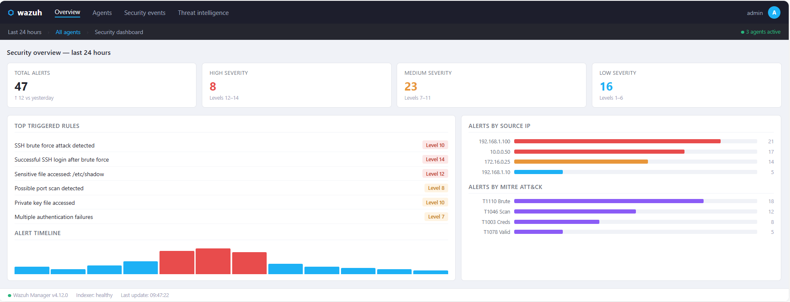
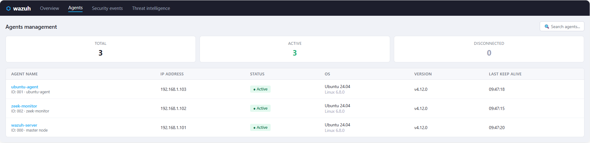
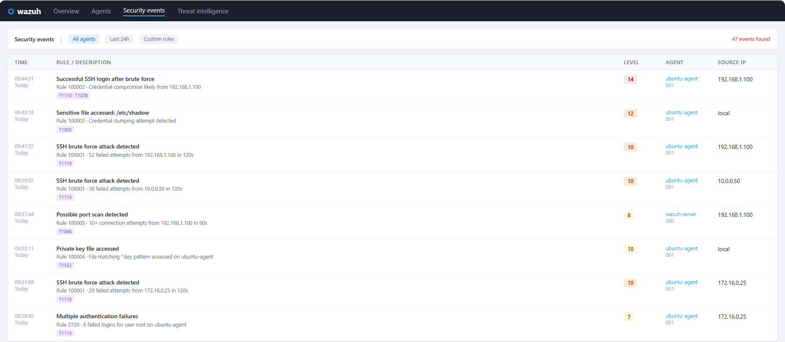

# 🛡️ Laboratorio SOC Casero — Wazuh + Zeek en Proxmox


Laboratorio SOC (Centro de Operaciones de Seguridad) montado íntegramente en un servidor Proxmox doméstico usando contenedores LXC ligeros. Cubre recogida de logs, detección de amenazas, análisis de tráfico de red y alertas en tiempo real — todo con herramientas open source y gratuitas.

---

## 📐 Arquitectura

```
┌─────────────────────────────────────────────────────┐
│              SERVIDOR PROXMOX (8GB RAM)             │
│                                                     │
│  ┌─────────────────┐  ┌──────────┐  ┌───────────┐  │
│  │ LXC 101         │  │ LXC 102  │  │ LXC 103   │  │
│  │ Wazuh Server    │  │ Zeek     │  │ Ubuntu    │  │
│  │ 5GB RAM         │  │ 1GB RAM  │  │ Agente    │  │
│  │ Manager         │◄─│ Monitor  │  │ 512MB RAM │  │
│  │ Indexer         │  │ de red   │  │           │  │
│  │ Dashboard       │◄─┼──────────┼──│ Agente    │  │
│  └─────────────────┘  └──────────┘  │ Wazuh     │  │
│           ▲                         └───────────┘  │
└───────────┼─────────────────────────────────────────┘
            │
     Navegador (Mac/PC)
     https://IP_WAZUH
```

---

## 🧰 Stack tecnológico

| Componente | Función | Contenedor |
|---|---|---|
| **Wazuh Manager** | SIEM — recoge y correlaciona eventos | LXC 101 |
| **Wazuh Indexer** | Almacena e indexa datos de seguridad | LXC 101 |
| **Wazuh Dashboard** | Interfaz de visualización (basada en OpenSearch) | LXC 101 |
| **Zeek** | Análisis de tráfico de red | LXC 102 |
| **Agente Wazuh** | Monitorización del endpoint y envío de logs | LXC 103 |

---

## 📋 Requisitos

| Recurso | Servidor Proxmox |
|---|---|
| RAM | 8 GB mínimo |
| Disco | 256 GB |
| SO | Proxmox VE 9.x |
| Red | LAN local |

---

## 🚀 Despliegue

### 1. Preparar el host Proxmox

```bash
# Descargar plantilla LXC de Ubuntu 24.04
pveam update
pveam download local ubuntu-24.04-standard_24.04-2_amd64.tar.zst

# Necesario para Wazuh Indexer (OpenSearch)
echo "vm.max_map_count=262144" >> /etc/sysctl.conf
sysctl -w vm.max_map_count=262144
```

### 2. Crear los contenedores LXC

```bash
bash setup/01_crear_lxc.sh
```

### 3. Instalar Wazuh (Manager + Indexer + Dashboard)

```bash
pct enter 101
bash /tmp/02_instalar_wazuh.sh
```

> La instalación tarda unos 20 minutos. Al finalizar muestra las credenciales del dashboard. **Guárdalas.**

### 4. Instalar Zeek

```bash
pct enter 102
bash /tmp/03_instalar_zeek.sh
```

### 5. Instalar el agente Wazuh

```bash
pct enter 103
WAZUH_MANAGER='TU_IP_WAZUH' bash /tmp/04_instalar_agente.sh
```

### 6. Acceder al dashboard

```
https://TU_IP_WAZUH
Usuario:    admin
Contraseña: (mostrada al finalizar la instalación)
```

---

## 🔍 Detecciones demostradas

### Fuerza bruta SSH
Simulado desde el contenedor agente:
```bash
for i in {1..20}; do
  ssh -o StrictHostKeyChecking=no usuario_falso@localhost 2>/dev/null
done
```

### Acceso a ficheros sensibles
```bash
cat /etc/shadow 2>/dev/null
find / -name "*.key" 2>/dev/null
```

### Escaneo de puertos / Reconocimiento
```bash
nmap -sV IP_WAZUH
```

Todos estos patrones generan **alertas en Wazuh** visibles en el dashboard de eventos de seguridad.

---

## 📸 Capturas del laboratorio

### Dashboard principal — Vista general


### Agentes conectados


### Eventos de seguridad — Alertas generadas


---

## 🗂️ Estructura del repositorio

```
soc-homelab/
├── README.md
├── LICENSE
├── .gitignore
├── setup/
│   ├── 01_crear_lxc.sh          # Crea los 3 contenedores LXC
│   ├── 02_instalar_wazuh.sh     # Instalador all-in-one de Wazuh
│   ├── 03_instalar_zeek.sh      # Monitor de red Zeek
│   └── 04_instalar_agente.sh    # Agente Wazuh en el endpoint
├── detecciones/
│   └── reglas_personalizadas.xml  # Reglas de detección propias
└── screenshots/
    ├── wazuh_dashboard.png
    ├── agents_connected.png
    └── security_events.png
```

---

## 🧹 Destruir el laboratorio

Cuando ya no necesites el laboratorio, destruye los contenedores desde la shell de Proxmox:

```bash
pct stop 101 && pct destroy 101
pct stop 102 && pct destroy 102
pct stop 103 && pct destroy 103
```

---

## 🎯 Habilidades demostradas

- Gestión de contenedores LXC en Proxmox
- Despliegue y configuración de SIEM (Wazuh)
- Monitorización de tráfico de red (Zeek)
- Despliegue de agentes en endpoints
- Correlación de eventos de seguridad
- Escritura de reglas de detección personalizadas
- Flujo de trabajo de triaje de alertas SOC

---

## 📚 Referencias

- [Documentación de Wazuh](https://documentation.wazuh.com)
- [Documentación de Zeek](https://docs.zeek.org)
- [MITRE ATT&CK T1110 — Fuerza bruta](https://attack.mitre.org/techniques/T1110/)
- [MITRE ATT&CK T1046 — Escaneo de servicios de red](https://attack.mitre.org/techniques/T1046/)
- [Documentación LXC de Proxmox](https://pve.proxmox.com/wiki/Linux_Container)

---

## ⚠️ Aviso legal

Este laboratorio está construido únicamente con **fines educativos** en una red doméstica aislada.
No utilices estas técnicas contra sistemas que no sean de tu propiedad o para los que no tengas autorización expresa por escrito.

---

## 📄 Licencia

Licencia MIT — libre para usar, modificar y compartir.
